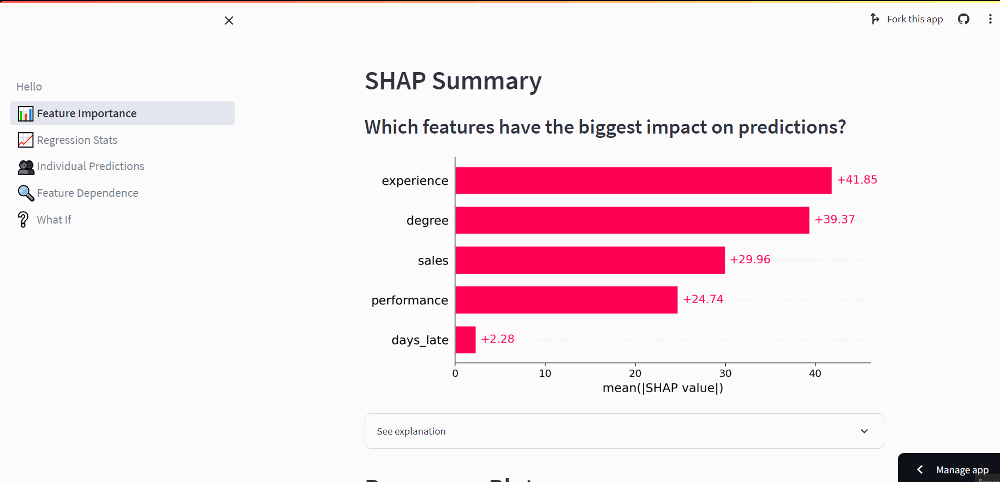

# SHAP Explainer

<div style="text-align:center;"></div>

This app serves as a starter guide for understanding and explaining regression models using SHAP values. 
It contains the following sections:

- **Feature Importance (📊)**: Analyze the significance of different features in the model.
- **Regression Stats (📈)**: Get statistical summaries and evaluations for the model.
- **Individual Predictions (👥)**: Generate and view individual predictions.
- **Feature Dependence (🔍)**: Examine how different features interact within the model.
- **What If (❓)**: Conduct 'What-If' analyses to understand how changes in feature values could affect predictions.

You can access a live demo of the app [here](https://shap-explainer.streamlit.app/).

## Setup

### To get started, clone this repository and navigate into the directory.

```bash
git clone https://github.com/ahmad-alismail/shap-explainer.git
cd shap-explainer
```

### Install the necessary dependencies with the following command:

```bash
pip install -r requirements.txt
```

### Run the app with Streamlit:

```bash
streamlit run hello.py
```

## Contributing

Feel free to fork the repository, make changes, and submit pull requests. Feedback is always welcome.

## License

MIT License